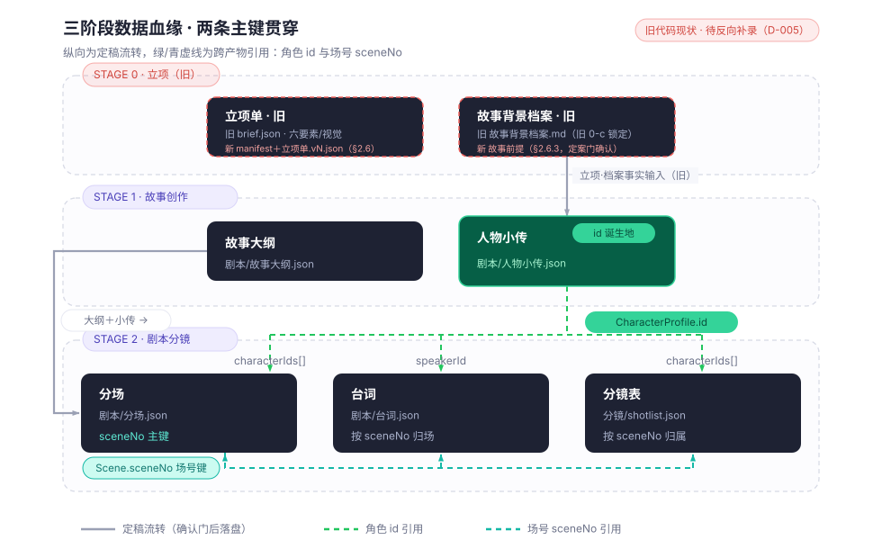

# 短剧 Agent 平台设计

> **定位**：一款模仿 MiniMax Design、为 AI 短剧从零设计的 **AI Agent 驱动内容生产平台**的实现层设计契约（源 · 权威）。本文件是产品与架构的事实源；配套《docs/design/短剧Agent平台-原型.html》（高保真界面原型）。
> 生成自：v1.0（2026-10-02）。**关键决策：完全脱离旧体系**——不沿用 proj.py、旧规范与旧数据结构，产品形态、多 Agent 架构、数据模型全部重新设计。原《AI短剧工作台系统设计》已作废并于 2026-10-09 删除（轨迹见《版本记录.md》）。情报来源见《docs/research/MiniMax Design功能与架构参考.md》。本文件的人读镜像位于 docs/design/ 同名 .html。

## 0. 定位

**产品本质**：一个"理解 → 拆解 → 并行执行 → 审核 → 交付"的短剧生产 Agent 平台。用户只表达创作目标（一句话或一份策划案），**主控 Agent 像导演一样把任务拆给一支虚拟摄制组**——编剧、美术、镜头、声音、引擎各有专职 Agent，它们在同一块画布上并行作业，自动产出剧本、定妆、分镜、镜头、配音、剪辑，直到成片交付。

不是"包一层命令行"，不是"一个聊天框 + 几个模型按钮"，而是：**一块画布 = 一条连续生产线；一个指令 = 一支全能团队**。

**目标用户与场景**：

- 个人短剧创作者 / 小型工作室：从灵感到成片不切换工具。
- 批量生产方：模板化、批量化产出多集 / 多版本。
- 优势场景：竖屏短剧、单元剧、系列化 IP、情绪向 / 恋爱向 / 校园向短内容（短、快、强情绪、模板化）。

**与旧体系的关系**：

| 旧体系 | 本平台 |
|---|---|
| proj.py 状态机 + 子进程包装 | 多 Agent 消息总线 + 专职 Agent 协作 |
| 规范 md 为流程事实源 | 平台内置生产工作流 + Skill 体系，规范不再以外部 md 存在 |
| 命令行 check/advance/record | 画布内确认门卡片 + Harness 自动校验 |
| 项目状态.json / 验收规则.json 等旧格式 | 全新数据模型（见 7） |
| 本地脚本 + 人工拼工具 | 本地优先 + 本地/局域网 ComfyUI 统一媒体引擎（qwen-image 图像 / H3 视频 / Music3 音乐，全部权重推理，媒体零公网），一键闭环（v1.7 修订） |

旧《AI短剧工作台系统设计》v1.1 曾作历史参考，该文档已于 2026-10-09 删除，不再指导开发。

### 0.1 开发原则与边界条件（v1.3 设立，v1.7 现行；2026-10-04 用户拍板）

> 以下四条为本项目立项级原则，是判断"做什么 / 不做什么 / 怎么做"的最高依据；与 AGENTS.md「本项目开发原则」保持一致。

**原则一 · 项目必要性**：本项目源于 MiniMax Design 的两处明确缺口——① 无法调用本地 / 局域网 ComfyUI；② 不具备旧工作体系的完整生产闭环。除填补这两类缺口所必需的功能外，不做无依据的功能扩张。

**原则二 · 局域网 ComfyUI 硬边界**：引擎层必须支持调用本地及局域网内的 ComfyUI 实例（地址可配置、支持多实例）。这是不可被"云端托管 / 仅本机托管"方案替代的红线；任何使局域网能力失效的设计视为破坏边界。

**原则三 · 八步闭环完整性**：平台必须完整支持旧工作体系的 8 步业务闭环，缺一不可，且每一步均有明确产物：

| # | 阶段 | 说明 |
|---|---|---|
| 0 | 立项 | 选题诊断（含六要素口径草案）/ 故事前提（故事背景档案）/ 立项定案卡 |
| 1 | 故事 | 大纲 / 人物小传 |
| 2 | 剧本分场 | 分场表 |
| 3 | 资产 | 角色 / 场景 / 道具资产（资产中心） |
| 4 | 分镜 | 分镜表（镜号 / 景别 / 运镜 / 资产引用） |
| 5 | 镜头 | 逐镜生成与收片 |
| 6 | 后期 | 剪辑 / 字幕 / 合流 / 混音 |
| 7 | 发布 | 成片 / 切片 / 渠道交付 |

> 现状（2026-10-08，D-005 后）：旧 22 个 feature 任务包已整体作废归档（见 docs/archive/），现存代码与新设计存在偏差，后续按《AI-SDG AI 工具执行指令》§7 存量功能反向补录六步法对照本设计重新建包。八步是**业务验收基线**，不允许在实现中合并或裁剪步骤（内部实现可复用同一组件，但用户可感知的阶段产物必须齐备）。

**原则四 · 继承 + 扩展**：

- **继承（形态对齐）**：MiniMax Design 已具备的功能，其交互形态、流程结构、数据表现直接对齐，保持用户体验一致；底层实现使用其同源开源组件（opencode 运行时、MCP 协议、Skill 格式）自行构建。Design 应用本体闭源，"复用"指形态对齐与开源组件复用，不含其专有代码。
- **扩展（缺口自研）**：Design 缺失的功能（局域网 ComfyUI、八步闭环中 资产/镜头/后期/发布 等）针对性自研扩展，并通过功能溯源标签 **[Design 原有] / [改编] / [自研新增]** 逐条标明来源，保证每个功能点可判定归属。

**原则五 · 生成通道红线（2026-10-04 用户拍板，v1.7 补执行路径终局）**：平台生成通道固定，不做多模型矩阵：

- **图像：仅 qwen-image**；
- **视频：仅 MiniMax H3**（本地 / 局域网 ComfyUI 工作流）。

- Agent 不得自行选择或切换到其他图像 / 视频模型；Design 的云端多模型矩阵（海螺 / 可灵 / Veo3 / Wan / seedream / Midjourney 等）在本项目中**不沿用**。
- **音乐：仅 MiniMax Music3**。
- 语音（TTS / 声音克隆）通道暂未限定，待后续决策。
- **执行路径（v1.7 终局，D-010）**：图像 / 视频 / 音乐三类媒体生成**全部经本地 / 局域网 ComfyUI 执行**——qwen-image、H3、Music3 均为**本地 / 局域网权重 / 工作流推理，纯局域网、不出公网、无按次云费用、无媒体类云端 API Key**；ComfyUI 是统一媒体引擎（复用 B0/B5/B8/B9 工作流模板）。平台出公网仅余文本侧火山方舟。renderer 不直连 ComfyUI，媒体调用一律收敛于 MCP / 主进程引擎工具。

### 功能溯源图例

本文每个功能点均标注来源，便于区分「照抄 MiniMax Design」「在 Design 基础上为短剧改造」「短剧专属自研」三类：

| 标签 | 含义 | 来源依据 |
|---|---|---|
| **[Design 原有]** | MiniMax Design 已有功能，本平台直接沿用形态 | 官方手册 / 官网 / 架构实测 |
| **[改编]** | Design 有此能力，但为短剧场景做了改造（角色、流程、数据结构等） | 对照 Design 后重设计 |
| **[自研新增]** | Design 没有，为本平台短剧生产专门新增 | 短剧专属决策 |

> 对照源：《docs/research/MiniMax Design功能与架构参考.md》（功能全景 §1、架构实测 §2、对照 §3）。

## 1. 设计原则

| # | 原则 | 内容 | 来源 |
|---|---|---|---|
| 1 | Agent 一等公民 | 用户只与主控 Agent 对话；所有动作由 Agent 规划与调度，界面是 Agent 的"工作台"而非"用户的工具箱" | [Design 原有] |
| 2 | 画布即真相 | 全部产物与过程在一块画布上可见，节点自动连线，数据流即视觉 | [Design 原有] |
| 3 | 人是导演，不是操作员 | 人只在关键节点做方向决策（确认门）；不做参数搬运、文件拼接 | [改编]（Design 有审核节点，本平台将其明确为唯一人工阻塞点） |
| 4 | 专职 Agent 并行 | 编剧 / 美术 / 镜头 / 声音 / 引擎各有专职，可并行推进；主控 Agent 负责拆解与合流 | [改编]（Design 为 router/planner/executor/media-agent/comfyui-agent，本平台改为短剧摄制组角色） |
| 5 | 经验可复用 | 一次跑通的过程可沉淀为 Skill；Skill 可分享、可一键复用 | [Design 原有] |
| 6 | 本地优先 | 素材与项目默认存本地；云端模型按任务调用；密钥不出本机 | [Design 原有] |
| 7 | 质量内建 | Harness 层在后台加载领域知识、多轮机器校验；不通过则进不了确认门 | [Design 原有] |
| 8 | 克制的画布自由 | 画布以"自动布局 + 视觉整理"为主，不做无约束自由编排，避免复杂度失控 | [改编]（Design 画布自由度较高，本平台明确收敛） |

## 2. 五步生产工作流

对齐 MiniMax Design 的连续创作链路，按短剧生产重构：

```
① 灵感输入          ② 画布编排          ③ 方法复用
 AGENT MODE    →    CANVAS FLOW   →    SKILL READY
 一句话/一份案       剧本·定妆·分镜·     专属 Skill /
 主控 Agent 拆解     镜头·声音·剪辑      广场工作流
 产出创意简报        全在一块画布         专业插件
        ↓                                       ↓
④ 本地衔接          ⑤ 审核交付
 LOCAL BRIDGE   →   REVIEW LOOP
 资产中心 / 本地     方向确认门 / Harness
 文件 / 专业工具     多轮校验 / 成片交付
```

1. **[改编] 灵感输入**：自然语言描述目标（"做一部校园恋爱短剧，女主大一新生，夏天的海边小城，每集 90 秒，先做第一集"）或丢入策划文档；主控 Agent 理解意图，产出**创意简报**（题材 / 人设 / 集数 / 时长 / 画幅 / 风格）与**任务地图**（DAG）。Design 的"创意简报 + 任务拆解"结构直接沿用，简报字段为短剧定制。
2. **[改编] 画布编排**：编剧出剧本与分场，美术出角色 / 场景资产，镜头 Agent 逐镜生成，声音 Agent 出配音与配乐，剪辑 Agent 合流——全部节点自动连线落画布。Design 原画布形态沿用，节点类型按短剧生产链重排。
3. **[Design 原有] 方法复用**：可调用 Skill 广场的成熟工作流（如"强情绪三连镜""日漫定妆流"），可挂载专业插件（3D 导演台、批量水印等）。
4. **[Design 原有] 本地衔接**：资产中心统一管理本地素材；画布产物自动本地化；支持外部专业工具导出 / 导入。
5. **[改编] 审核交付**：每个关键节点 Agent 主动发起方向确认；Harness 后台多轮校验；通过后交付成片与切片。Design 的"审核节点 + Harness 校验"沿用，确认门触发点按短剧阶段（简报/定妆/分镜/整集/成片）设定。

### 2.6 立项阶段（STAGE 0）详解 [自研新增]

> 本节经《2002 相识》立项流程对话推演（2026-10-08）重写，取代旧版「4 节点（创意输入→选题诊断→立项单→故事背景档案）+ 4 确认门（0-a~0-d）」模型；旧模型与真实生产实践不符，已随 D-005 作废。

**立项阶段目标**：在进入 STAGE 1（故事）前，通过对话收敛三件事——**口径**（六要素：做什么、在哪发、多长、什么形态）、**故事前提**（时间 / 地点 / 人物 / 核心事件 / 边界）、**视觉风格**（1 个主风格 + 可选 1 个辅助气氛）。立项不是填一张多 tab 表单，而是一段持续收敛的对话；界面只做两件事：随时呈现已捕获的内容、在就绪时给出一键定案。

**总体模型：1 个入口动作 + 2 个节点 + 1 道定案门**

```
[一句话创意]  →  ① 选题诊断         →  ② 故事前提       →  🚪 立项定案门
  入口动作        （含六要素口径草案）    （背景档案·对话收敛）   就绪即发定案卡
   ↘ 反问关键分叉（商业短剧 / 个人纪念）                         一键 / 口头拍板
   ↘「已捕获口径」区从第一句话起持续可见、随时可改
```

一句话创意只是**入口动作**，不占节点；节点之间不是严格的单向门——用户随时可以回到任何已捕获内容上修改，Agent 在对话中同步更新。

#### 2.6.1 入口：一句话创意与反问机制

用户说出一句话创意（如「我想做一个我和我老婆认识的故事，发生在 2002 年」）后：

1. **Agent 先反问关键分叉**，不直接开干。第一问是项目性质：**商业短剧**（要上平台，讲打法、合规）还是**个人纪念**（不以投放为目的）？这一问决定选题诊断与六要素草案的方向。
2. **未回答前，能记录的先记录**。从创意中可直接提取的事实（时间=2002、核心事件=相识、人物关系=夫妻）立即写入「已捕获口径」区，不等用户回答反问。
3. 用户回答后（如「商业短剧」），Agent 带着补充口径进入节点①。

**「已捕获口径」区**：立项界面的常驻区域（对话区旁 / 画布侧栏），从第一句话起持续累积；每条口径标注来源（用户原话 / Agent 推断待确认），用户随时可直接修改或在对话中纠正。它是两个节点与定案卡的共同数据源，不是某个节点的专属产物。

#### 2.6.2 节点①：选题诊断（含六要素口径草案）

主控 Agent 基于已捕获口径检索同赛道公开数据，产出**选题诊断卡**；商业短剧与个人纪念走不同详略：

| 区块 | 内容 | 个人纪念口径 |
|---|---|---|
| 同赛道对标案例 | 案例名 / 平台 / 成绩 / 打法 / 启示 | 弱化为风格参考 |
| 用户洞察 | 赛道用户迁移方向 | — |
| 爆点 / 钩子模式库 | 先婚后爱 / 明撩暗撩 / 日常治愈 / 双向救赎 + 钩子工程 | 不强制 |
| 合规风险 | 备案分级、AI 融像 / 融声授权、平台审核 | 仅提示私人影像使用边界 |
| 结论 | 可做 / 不可做 / 需调整 + 打法与集数区间 | 直接判「可做」 |

诊断产出的同时，Agent 给出**六要素口径草案**（全部预填、全部可改，不再设独立的多 tab 立项单审批）：

| 要素 | 说明 | 2002 相识案例（纪念倾向） |
|---|---|---|
| 题材赛道 | 如「都市爱情（女频）」 | 青春 / 爱情·年代纪念 |
| 目标平台 | 抖音 / 小红书 / 红果，含定位（投流 / 种草 / 切片） | 待定（纪念用途） |
| 单集时长 | 建议主力时长 | 待定 |
| 集数 | 以内容定或设区间 | 待定 |
| 风格基调 | 故事氛围基调 | 千禧清新怀旧·温馨 |
| 画幅 | 按平台规则派生，必填 | 待定 |

用户的处理方式是「看诊断 + 看草案，有倾向就让 AI 再调，具体要改什么直接说」——可以只改六要素，也可以只追故事前提，顺序自由。

#### 2.6.3 节点②：故事前提（故事背景档案的形成方式）

故事前提不是 STAGE 1 的完整故事，也**不是让用户填模板**，而是进入故事创作前的准备性事实：**时间、地点、人物基本信息、核心事件、本季边界**。它以对话收敛的方式形成，沉淀为「故事背景档案」——人提供（或确认）的原始事实，是后续编剧的不可篡改依据。

Agent 的两种工作方式：

- **信息相对全**：Agent 先编一个「假的」前提版本（合理虚构的人物身份、相遇场景），用来引出真人真事；用户照着纠正即可，不必从零组织语言。
- **信息不全**：Agent 先问几个关键事实（主角是谁、多大、在哪、怎么遇上的），再动笔。

**故事前提最低门槛（暂定，开发中发现不够再议）**：

| # | 项 | 最低要求 |
|---|---|---|
| 1 | 人物 | 主角身份 / 年龄（双方） |
| 2 | 时间 | 故事发生时间（如 2002 年） |
| 3 | 地点 | 故事发生城市 / 环境 |
| 4 | 核心事件 | 相遇方式一句话 |
| 5 | 边界 | 本季讲到哪（如第一季只讲相识） |

《安妮的夏天》实测事实即此形态：林夏 19 岁学金融不住校、陈默 22 岁父母离婚随父、单位距林家 2–3 公里、第一季 = 相识（01–11 集）。

#### 2.6.4 视觉风格选型：主风格 + 辅助气氛

视觉风格必须从系统级外部数据库《AI短剧制作视觉风格谱系》中选取（见 §8.3），**Agent 不得凭印象自创画风**——谱系条目是经过 qwen-image + MiniMax H3 出图论证的视觉解决方案。Agent 先按题材匹配一个，人可以改，立项后也可以改；风格影响提示词生成，改风格触发全链路提示词重出。

选型模型是三条正交的轴：

| 轴 | 取值 | 语义 |
|---|---|---|
| **使用角色轴** | 主风格 ×1 | 全片唯一，= 家族 + 具体风格；任何时刻仅 1 个，后期可换但不能并存 |
| | 辅助风格 0–1 个 | 按剧情需要挂的「**气氛**」（如都市剧挂悬疑气氛）；不挂亦可 |
| **验证状态轴**（谱系内标记） | 「主」 | 被真实项目（安妮的夏天）验证跑通的条目（11 项） |
| | 「备」 | 已登记但未经项目验证的主风格候选（7 项）；主风格候选含全部主 + 备条目，选「备」风险自担（可能出不来效果） |
| **形态轴** | A 写实影像 / B 青春治愈 / C 卡通 / D 类型氛围 等家族 | 仅用于谱系归类与检索 |

**辅助风格候选域封闭**：只能从 **B 青春治愈系（1 项：清新生活流）** 与 **D 类型氛围系（5 项：冷调悬疑 / 赛博科幻 / 神话国风为「主」，奇幻童话 / 暗黑哥特为「备」）** 中选取。辅助挂的是跨形态的气氛，不改变主风格的画风归属。

> 注意：谱系只管**画风**。年代（2002）、地域等事实作为**内容**进入提示词，不作为选择画风 ID 的依据（如「2002 年」不必然推出「年代胶片」画风）。

项目数据中的风格引用记录为「**风格 ID + 谱系版本**」（如 `A7 @ v1.46`）；当前谱系版本 v1.46（2026-10-08，措辞修订；上一版 v1.45 / 2026-10-01）。

#### 2.6.5 定案门：就绪判定与立项定案卡（v1.10 语义修订）

立项只有**一道**门，是就绪条件的客观判定，不搞逐产物审批。**门后字段仍可改**（见 §2.6.6），定案门的本质是"**当前版本的落定**"，不是"灵魂边界"。

**就绪条件（全部满足）**：

1. 六要素均有取值（「待定」视为有值，但在定案卡上显式标注，由用户确认接受）；
2. 故事前提达到最低门槛（5 项）；
3. 已选定 1 个主风格。

满足后 Agent 主动发出**立项定案卡**：

```
┌─ 主控 Agent · 立项定案卡 v(N+1) ───────────────────────┐
│ 六要素：青春爱情·纪念向 / 平台待定 / 时长待定 /        │
│        集数待定 / 千禧清新怀旧 / 画幅待定              │
│ 故事前提：2002 · 某城 · 男女主身份年龄 · 相遇方式      │
│ 主风格：A7 ××× @ v1.45（备：未经项目验证）             │
│ 辅助风格：D 冷调悬疑气氛（可选）                       │
│                                                       │
│ 相对 vN 改动：集数 8→10、风格 A7→A5（影响评估见下）     │
│                                                       │
│ [发布立项 v(N+1)]  [再改改]  [查看历史]                │
└───────────────────────────────────────────────────────┘
```

- **一键拍板**：点「发布立项 v(N+1)」→ 立项单 `立项单.v(N+1).json` 落盘，旧版 vN 留底；进入 STAGE 1。
- **口头拍板等价**：用户在对话里说「行，开始讲故事吧」等同拍板；系统记录**用户原话**与定案卡（立项单）版本号，效果与按钮完全一致。
- 未就绪时 Agent 不发定案卡，而是明确指出缺什么（如「还差故事边界：这季讲到哪？」）。
- **跨版本改动提示**：定案卡中显式列出"相对上一版本的改动"与"影响产物清单"（见 §2.6.7），让用户在拍板前就看到下游代价。
- **历史回溯**：所有历史版本（v1..vN）永久保留，支持 diff 视图与任意版本回滚（回滚 = 当前版本再发一版，内容 = 选中历史版）。

#### 2.6.6 立项后的变更：全字段可改 + 影响评估 + 用户决策（v1.10 升级）

> v1.9 的"反补机制"将立项视为半锁定（核心 premise 不可改），v1.10 经用户拍板（2026-10-09）改为**全字段可改 + 影响评估**——立项不再有"灵魂边界"，所有字段（含 premise）任何阶段都可改；改后系统标记下游影响点，由用户决定是否重生成。决策记录见 D-011。

**核心三原则**：

1. **全字段可改**：L0（项目名 / 标签 / 备注）、L1（集数 / 时长 / 受众 / 基调 / 画幅）、L2（故事前提 / 主风格）任何字段在 STAGE 0/1/2/3/4/5/6 任何阶段都可改。无 disabled、无锁形 icon。
2. **影响必标记**：每次保存（落盘新版本 v(N+1)）时，系统按 `project.manifest.json` 的依赖图反向追溯所有**已生成的引用了被改字段的下游产物**，列入"待对齐清单"。
3. **决策归用户**：受影响产物**不自动重生成**；用户从"一键重生成 / 仅标记脏 / 取消"三个动作中三选一；不重生成的产物继续保留，下游走脏读（"基于 vN 立项生成，与 v(N+1) 不一致"提示）。

**触发入口**（在 STAGE 0 步骤内的 v1.9 立项视图中可改；也支持在 STAGE 1+ 通过对话提出）：

- **v1.9 立项视图**：所有 L0/L1/L2 字段可编辑，底部"发布立项 v(N+1)"按钮（取代旧"立项完成"按钮的锁死语义）。
- **对话方式**：用户说"把集数改成 12 集" → Agent 改字段并提示"已记录，将在下次发布时落盘 v(N+1)"，用户口头/按钮拍板等价。
- **流程导航快捷入口**（方案 A 左栏流程导航分区）：点 STAGE 0 步骤进入 v1.9 视图，步骤旁显示当前版本号 + 待对齐计数（`✓ v3` / `v1 ⚠️2`）。
- **生产中实测反补**：STAGE 3 资产规格不符、STAGE 4 分镜时长不匹配等实测问题，可在产出节点旁"反补到立项"按钮发起变更。

**字段改动与影响范围映射**（v1.10 现状；具体阈值后续在 feature-005/006 任务包细化）：

| 字段分类 | 字段举例 | 可能影响的下游产物 |
|---|---|---|
| 项目名 / 标签 | `name` / `tags` | 仅元数据；下游无感 |
| 集数 / 单集时长 | `集数` / `单集时长` | 分场表行数 / 单镜头时长 / 后期轨道数 |
| 画幅 / 比例 | `画幅` | 全部资产规格 / 镜头分辨率 / ComfyUI 工作流参数 |
| 受众 / 题材 | `题材` / `受众` | 主控 Agent 提示词 / 选题诊断案例 / 视觉风格选型 |
| 主风格 | `主风格` | 全部提示词 base / 资产风格 / 镜头色彩 |
| premise 核心 | `故事前提` 任意子项 | 故事节点 / 剧本分场 / 角色设定 / 全链路提示词 |

**"待对齐"语义**：

- 产物节点挂角标 ⚠️"基于 vN，与 v(N+1) 不一致"，hover 显示"哪个字段与新版本不符"。
- 节点不丢，不灰显，不阻止后续编辑——用户照常使用，下游引用一律走脏读。
- 脏读 = 产物内部 `parentReference: { briefVersion: vN }` 字段保留，运行时不报错，提示文案出现。
- 一次重新打开产物编辑 = 触发"是否按 v(N+1) 重新对齐"二次确认。

**历史版本与回滚**：

- 立项单全量保留 v1..vN，对应文件 `立项/立项单.vN.json`（每次发布生成一份，永不覆盖）。
- "查看历史"按钮：左右两栏 diff 视图（vN vs v(N+1)）+ 任选历史版回滚。
- 回滚 = 新发一版 `立项单.v(N+1) = 立项单.vK 的内容`；保留全部历史。

**STAGE 0 步骤的视觉**（方案 A 左栏流程导航 + titlebar 进度轨）：

| 状态 | 流程导航步骤显示 | titlebar 进度轨步骤显示 |
|---|---|---|
| 立项未完成 | 跳动 STAGE 0 | STAGE 0 灰底 |
| v1 已发布 · 全对齐 | `✓ v1` 绿色 | `0` 灰 + tooltip "v1 · 7 产物已对齐" |
| v1 已发布 · 有未对齐 | `v1 ⚠️2` 黄色 | `0` 灰 + tooltip "v1 · 5 产物已对齐 · 2 待处理" |
| v3 当前最新 | `✓ v3` 绿色 + hover 历史 v1→v2→v3 | `0` 绿 + tooltip "立项 v3 · 全对齐" |

详见 §2.6.7 影响评估机制、§2.6.8 画布布局与界面对应。

#### 2.6.7 影响评估机制：追溯算法、面板与三选一动作（v1.10 新增）

> 本节细化 §2.6.6 提出的"影响必标记 + 决策归用户"，给出可执行算法与 UI 草图。落地包后续在 feature-005/006/008 任务包分别承接（数据模型 / Agent 提示词 / 影响评估面板 UI）。

**追溯算法**（用户在 v1.9 视图点「发布立项 v(N+1)」时触发）：

1. **diff 提取**：对比 `立项单.vN.json` 与 `立项单.v(N+1).json`，得到变更字段集合 Δ = {`集数: 8→10`, `主风格: A7→A5`, ...}。
2. **依赖图反向遍历**：从 `project.manifest.json` 的 `nodes[*].parentReference` 出发，遍历所有 `parentReference.briefVersion == vN` 的产物节点；不限于 STAGE 0 直接下游，覆盖全链路（剧本分场、角色、场景、道具、镜头、音乐、剪辑成片等）。
3. **影响字段命中**：对每个候选产物，比对其 `parentReference.fields[*]` 与 Δ 的交集；非空 = 受影响，加入"待对齐清单"。
4. **影响分级**（决定面板中的颜色与默认动作）：

| 级别 | 触发条件 | 视觉 | 默认动作 |
|---|---|---|---|
| 高 | premise 核心 / 主风格 / 画幅 改动 | 红色 ⚠️ 必重生成 | 一键重生成（勾选默认） |
| 中 | 集数 / 单集时长 / 受众 / 基调 改动 | 黄色 ⚠️ 建议重生成 | 仅标记脏（需用户勾选才重生成） |
| 低 | 仅元数据（项目名 / 标签 / 备注） | 灰色 · 无影响 | 不在清单中（直接落盘） |

5. **清单落盘**：写入 `立项/影响清单.vN→v(N+1).json`（含时间戳、改动字段、影响产物列表、分级、用户最终决策），供回溯与 Harness 校验。

**影响评估面板 UI 草图**（保存时自动弹出，用户必须三选一后才能关闭）：

```
┌─ 影响评估 · 立项 v3 相对 v2 改动 ──────────────────────┐
│ 改动字段（3 项）：                                        │
│  · 集数 8 → 10          [高]                             │
│  · 主风格 A7 → A5       [高]                             │
│  · premise 第 2 句修订  [中]                             │
│                                                        │
│ 影响下游产物（7 个，按级别排序）：                         │
│  ☑ [高] STAGE 2 · 分场表 (8→10 场)                     │
│  ☑ [高] STAGE 3 · 角色资产 (3 个 · 全部重生成)          │
│  ☑ [中] STAGE 3 · 场景资产 (5 个 · 主风格变更)          │
│  ☐ [中] STAGE 4 · 分镜表 (24 个 · 集数变更)              │
│  ☐ [中] STAGE 5 · 镜头 (镜头 1-12)                      │
│  ☐ [中] STAGE 5 · 镜头 (镜头 13-24)                     │
│  ☐ [中] STAGE 6 · 后期 (BGM 选曲 / 调色)                 │
│                                                        │
│ [一键重生成选中 (4)]  [仅标记脏]  [取消]                 │
└────────────────────────────────────────────────────────┘
```

**三个动作的语义**：

- **一键重生成选中**：已生成的产物按"旧版本重新生成"（提示词 base + 参考资产 = 旧版，但 `parentReference.briefVersion` 改为 v(N+1)）；未生成的产物按 v(N+1) 立即生成。重生成以 Agent 串行/并行执行，进度实时回报。
- **仅标记脏**：所有受影响产物保留旧内容，节点挂 ⚠️ 角标，`parentReference.briefVersion` 仍为 vN；下次手动打开该产物编辑时，触发"按 v(N+1) 重新对齐"二次确认。
- **取消**：v(N+1) 不落盘，字段改动只在内存中保留——用户放弃本次发布。

**脏读运行时表现**：

- 产物使用旧立项版本生成，运行时照常；UI 顶部出现黄色提示条："当前基于 vN 立项，与最新 v(N+1) 不一致；点此查看差异 [查看影响评估] [一键对齐]"。
- Agent 引用产物时，自动在提示词中追加"⚠️ 此产物基于 vN，与项目最新立项 v(N+1) 不一致"标记，提醒 Agent 在生成下游时考虑差异。
- 不阻止用户继续创作——用户主权优先。

**Harness 校验补充**（§9 质量层联动）：

- 影响清单 `立项/影响清单.vN→v(N+1).json` 永久留底；下次发布 v(N+2) 时一并作为历史参考。
- 用户选择"仅标记脏"超过 30 天未处理，Harness 给出"立项基线已漂移 N 天"提醒（不阻塞）。

#### 2.6.8 画布布局与界面对应（原 §2.6.7 升级）

立项画布是一条**线性收敛链**（非 DAG），两个节点：

```
[① 选题诊断] ───→ [② 故事前提] ───→ 🚪 定案卡
 含六要素口径草案     对话收敛·背景档案
```

- 创意输入框与「已捕获口径」区为常驻元素，不画成节点。
- **选题诊断卡**：对标 / 洞察 / 钩子 / 合规 / 结论可折叠，内嵌六要素草案（字段直接可改，不再设独立 tab 审批页）。
- **故事前提卡**：对话驱动的结构化呈现（非空白富文本模板）；AI 先编的「假版本」与人确认的事实分色显示，事实带「不可篡改」水印。
- 视觉风格选型嵌在对话流与定案卡中：谱系条目可点选查阅，选中项显示风格 ID、主 / 备验证状态、谱系版本。
- Agent 主动行为：创意后立即反问 + 记录；诊断就绪自动出草案；前提卡住时主动追问缺口；就绪条件满足自动发定案卡。

> 设计原则：立项阶段用户只做**回答 / 纠正**和**拍板**，不做检索、不做字段搬运、不做格式整理。

**与文档其他部分的对应**：

- **数据模型**：`project.manifest.json` 存六要素终值 + 风格引用（风格 ID + 谱系版本）+ 当前立项版本号 `briefVersion`；`立项/选题诊断.json`、`立项/故事背景档案.md`（人确认的原始事实）、`立项/立项单.vN.json`（定案卡快照，含拍板方式与用户原话，全量保留 v1..vN）、`立项/影响清单.vN→v(N+1).json`（改动 + 影响产物列表 + 用户决策）。每个下游产物节点 `parentReference: { briefVersion, fields[*] }` 记录生成时所用版本。
- **外部数据源**：视觉风格谱系的路径注册与版本跟踪见 §8.3，与 ComfyUI 接入同级管理。
- **Skill 沉淀**：一次完整立项可沉淀为「赛道立项模板」Skill（口径取值 + 风格选型 + 对标案例）。
- **Harness 校验**：定案前校验就绪条件；校验风格锚词在提示词 Base 中一致出现、画幅口径在资产目录结构中落实、合规红线已标记。
- **与方案 A 左栏融合**：立项画布（线性收敛链）与创作画布（DAG）共用三栏骨架；左栏"流程导航"分区与"资源库"分区顶部分段 toggle（详见方案 A 落地；STAGE 0 步骤显示立项版本号 + 待对齐计数）。
- **titlebar STAGE 进度轨**：全局八步 0→7 进度环（详见 §3.x 与原型）；STAGE 0 步骤 hover tooltip 显示"立项 vN · X 产物已对齐 · Y 待处理"；点击切到 v1.9 立项视图。

## 3. 界面设计

### 3.1 总体布局（三栏 + 顶栏 + 底条） [Design 原有]

（三栏形态与区域划分直接沿用 Design：左 Skill/模板/资产/插件 · 中画布 · 右 Agent）

| 区域 | 内容 | 来源 |
|---|---|---|
| 顶栏 | 项目切换 · 当前 Skill 标识 · 模型选择器（按任务自动匹配，可手动）· 协作 / 导出 · 账号与积分 | [Design 原有] |
| 左侧栏（约 260px） | **项目**（项目库 / 任务地图概览）· **Skill**（广场 / 我的 / 模板中心）· **资产**（角色 / 场景 / 道具 / 音色，缩略图浏览与点选）· **插件** | [改编]（左栏四个一级入口沿用 Design；资产"音色"、项目"任务地图"为短剧新增） |
| 中间画布 | 点阵背景上的节点与自动连线：阶段节点 + 产物卡；缩放 / 平移 / 小地图；对齐参考线与自动吸附 | [Design 原有] |
| 右侧栏（约 380px） | **Agent 对话流**：消息 · 工具调用轨迹（工具名 / 参数 / 结果，可折叠）· **确认门卡片**（校验结果 + 确认 / 否决）· 多 Agent 在岗状态 | [改编]（对话 + 工具轨迹沿用 Design；确认门卡片、多 Agent 在岗状态为新增） |
| 底部状态条 | 引擎连通性（云端 + 本地引擎地址）· 批处理队列进度（已提交 / 完成 / 失败 + 镜号）· Harness 校验摘要 | [自研新增]（Design 无此状态条） |

视觉语言（对齐 MiniMax Design 真实界面）：浅色近白背景 + 点阵纹理；紫色主强调（按钮 / 选中框 / 关键连线）；黑色胶囊主按钮；圆角 10–14px 卡片；克制的阴影与细边框；无衬线字体，标题字重对比鲜明。 [Design 原有]

### 3.2 画布语义

- **[Design 原有] 节点类型**：文本（剧本 / 台词）· 表格（分场 / 分镜）· 图片（概念 / 定妆 / 关键帧）· 视频（镜头 / 成片）· 音频（配音 / 配乐）· 控制件（时间线 / 批处理）· 插件卡（3D 导演台等）。Design 节点类型直接沿用。
- **[Design 原有] 连线 = 数据流（单向 DAG，禁循环）**：剧本 → 角色 / 场景资产 → 分镜表 → 逐镜任务 → 镜头产物 → 声音轨道 → 时间线 → 成片；连线上标注衔接数据。连线形态沿用，数据流路径按短剧生产链设定。
- **[Design 原有] 自动布局**：节点按任务地图自动落位与连线；允许手动拖动做视觉整理（不改变数据依赖）；对齐参考线 + 吸附。
- **[改编] 节点状态**：已完成（纯色徽标）/ 进行中（动态描边）/ 等待中（灰）/ 失败（红点名）/ 待确认（紫色脉冲）；下游受影响沿连线标色提示。Design 有节点状态，"待确认紫色脉冲""受影响标色"为本平台细化。
- **[改编] 节点信息**：版本号、来源 Agent、模型与档位、seed / 参数、产物缩略图、Harness 校验明细；点击节点 → 右侧定位到对应对话与确认门。信息字段为短剧生产定制。
- **[Design 原有] 产物操作**：节点上可预览、替换、重生成、沉淀为 Skill；导出到本地或资产中心。

### 3.3 确认门（人是导演） [改编]

（Design 有"审核节点 + 方向确认"，本平台把它明确为唯一人工阻塞点的卡片组件；否决反馈公式直接采用 Design 协作规范原文。）

- 在每个关键节点（创意简报 / 定妆 / 分镜 / 整集镜头 / 成片），Agent **暂停下游调度**并发起确认门卡片。
- 卡片显示：Agent 的方案摘要 + Harness 校验结果（通过 / 失败点名）+ 预期结果说明。
- 操作：**确认**（继续下游）/ **否决**（填写"保留什么 + 修改什么 + 为什么 + 期望结果"，Agent 重做）/ **改部分**（局部修改后重跑校验）。其中"保留+修改+为什么+期望结果"公式直接取自 Design 协作规范。
- 确认门是唯一的人工阻塞点；不存在隐藏的自动放行。

### 3.4 对话区 [Design 原有]

- 与主控 Agent 对话；Agent 回复中的简报、任务地图、确认门、失败点名渲染为结构化卡片。
- 工具调用轨迹逐步展开（哪个专职 Agent、哪个 MCP 工具、参数与结果）。
- `/` 唤起 Skill 与命令；`@` 指向资产 / 节点。
- 对话即过程档案，随项目本地持久化，可回溯每一步决策。

## 4. 多 Agent 架构

### 4.1 角色分工 [改编]

（Design 实测 Agent 角色为 router / planner / executor / media-agent / comfyui-agent；本平台按短剧摄制组重命名与重划分，执行机制参考 opencode。）

| Agent | 类比角色 | 职责 | 来源 |
|---|---|---|---|
| **主控 Agent（导演）** | 导演 / 制片 | 理解意图；产出创意简报与任务地图；任务拆解、派发、合流；持有确认门状态机；模型自动选配 | [改编]（对应 Design 的 router + planner 合并，职责短剧化） |
| **编剧 Agent** | 编剧 | 故事大纲、人物小传、分场、台词、分镜文字稿；风格与节奏控制 | [自研新增]（Design 无短剧专属编剧角色） |
| **美术 Agent** | 美术指导 | 角色概念 / 定妆、场景、道具、关键帧、风格包；维护视觉一致性配方 | [改编]（对应 Design 的 media-agent 图像能力，拆出短剧美术角色） |
| **镜头 Agent** | 摄影 / 特效 | 逐镜生成参数组装、参考图编排、镜头提交、首帧 / 动作 / 运镜控制 | [改编]（对应 Design 的 comfyui-agent / media-agent 视频能力，拆出短剧镜头角色） |
| **声音 Agent** | 声音设计 | 配音任务（一期人机通道）、配乐、音效、混音方案；音频续写 / 隔离 | [改编]（对应 Design media-agent 音频能力，增加短剧配音/混音职责） |
| **引擎 Agent** | 片场 / 工程 | 本地 / 云端引擎调度、工作流装载、队列、轮询、产物落盘、断点续跑 | [改编]（对应 Design comfyui-agent，扩展为通用引擎调度） |
| **剪辑 Agent** | 剪辑 | 粗剪拼接、字幕、转场、合流、混音、切片、封面 | [改编]（对应 Design 视频剪辑插件能力，提升为专职 Agent） |

### 4.2 协作模型 [自研新增]

（Design 实测为标准 opencode + MCP 网关，未公开内部协作总线细节；以下消息总线 / 共享黑板 / 失败隔离为本平台架构决策。）

- **主控 → 专职**：主控按任务地图把任务派发到专职 Agent 的收件箱；专职 Agent 完成后回报产物与状态。
- **并行执行**：无依赖的任务并行（如角色定妆与场景概念并行；多镜入队批量生成）；有依赖的任务经数据节点合流（分镜未定不排镜）。
- **消息总线**：Agent 之间不直接互调，统一经总线交换"任务 / 产物 / 事件"消息；全部消息留痕，可重放。
- **共享上下文**：项目级黑板（当前设定、资产版本、采用决定）对所有 Agent 可见；设定变更发布"变更事件"，下游订阅并自检受影响范围。
- **失败隔离**：单个任务 / 镜头失败不拖垮整批；失败事件进确认门由人决策（重试 / 降级 / 跳过）。

### 4.3 Agent 内部循环 [改编]

每个专职 Agent 统一遵循：`接收任务 → 检索上下文与知识 → 规划步骤 → 调用 MCP 工具 → 自校验 → 回报 / 进确认门`。Agent 无删除权限，产物一律写新版本；越权动作（删除 / 对外提交 / 放行）必须经确认门。（循环骨架参考 Design 的 Agent 执行模式，权限边界为本平台安全策略。）

## 5. MCP 工具层与对话生成网关 [改编]

（Design 实测：标准 opencode + MCP 网关指向 localhost:8001，工具集为 `mcp-tools/hub_*`（画布读写、媒体生成、ComfyUI 工作流管理）。本平台保留 opencode 运行时 + MCP 网关架构，工具族按短剧生产重新划分，renderer 不直连引擎。）

### 5.1 对话生成网关（runtime 单轨，v1.11 定稿）

对话与生成统一经 **Agent 运行时单轨（runtime:\*）**，不设预置"生成动作"业务 IPC / 工具——旧 8 个 `agent:*` IPC 与 `shortdrama_*` 生成工具已退役、不再重建（2026-10-09 用户拍板"不回退"）。诊断 / 选题 / 大纲 / 小传 / 分场 / 台词 / 分镜 / 改写等生成动作，全部由会话内 Agent 规划完成。

| 通道 | 职责 |
|---|---|
| `runtime:start / stop / status` | 运行时生命周期与状态（stopped / starting / running / error；首次业务访问惰性自启） |
| `runtime:session:create / list / abort / delete` | Agent 会话管理；会话声明可用 MCP 工具（`tools[]`） |
| `runtime:prompt / prompt:async` | 消息入会话，Agent 规划并调用工具；异步走事件流 |
| `runtime:event:subscribe / unsubscribe` | 事件流：text / reasoning / tool.call / structured 分轨，UI 可折叠展示 |

- **上下文依赖原则**：生成动作只读**已定稿**上游产物（立项单 → 大纲 → 小传 → 分场 → 台词 → 分镜），Agent 经 MCP 工具（canvas / file / asset / gate）读取与写入；缺上游由 Agent 报告缺料，不静默产出（数据血缘见 §7.1）。
- **错误码**：统一走 runtime 错误码（`INVALID_ARGUMENT` / `RUNTIME_NOT_READY` / `SESSION_NOT_FOUND` / `PROMPT_FAILED` / `UPSTREAM_AUTH_MISSING` / `PATH_ESCAPE_DENIED` / `GATE_TIMEOUT` 等 14 个，见 `electron/runtime/types.ts`），经 envelope.error 透出；旧业务错误码（`STORY_CTX_MISSING` / `REVISE_*` / `STYLE_NOT_IN_CATALOG`）已随旧 IPC 退役，不沿用。
- **无 Key 行为**：未配置火山方舟 Key → 显式报 `UPSTREAM_AUTH_MISSING` 提示配置，**不静默降级 mock**（旧 mock 降级策略随旧 IPC 退役）。

### 5.2 工具族（MCP 网关：已落地 + 目标）

平台内置 MCP 网关（仅本机可达），全部工具以 schema 声明、统一鉴权与审计。**已落地（磁盘实况，11 个纯工具）**：

| 工具族 | 代表工具 | 说明 |
|---|---|---|
| 画布 | canvas.get / canvas.update | 画布节点与连线读写 |
| 文件 | file.list / file.read / file.write | 项目内文本产物读写（路径白名单） |
| 资产 | asset.list / asset.register | 资产索引检索与登记 |
| ComfyUI | comfyui.instances / comfyui.queue / comfyui.status | 引擎实例探活、队列、状态（renderer 不直连） |
| 确认门 | gate.request | 确认门请求（放行 / 否决须确认令牌） |

**目标族（随 feature 包逐步落地，§11 路线）**：

| 工具族 | 代表工具 | 说明 | 来源 |
|---|---|---|---|
| 项目 | project.manifest / events / timeline | 项目元信息、事件流、任务地图 | [自研新增]（短剧项目数据结构） |
| 媒体生成 | image.submit / video.submit / music.submit | **三类媒体全部经本地 / 局域网 ComfyUI（v1.7 终局，D-010）**：image.submit → **qwen-image 权重**（B0）；video.submit → **MiniMax H3 工作流**（B5/B8）；music.submit → **MiniMax Music3 权重**（B9）；均为提交 / 轮询 / 收片，纯局域网、媒体零公网 | [改编]（Design 媒体生成 MCP；模型按原则五锁定，执行统一 ComfyUI 权重推理） |
| 引擎 | engine.list / workflows.load / queue / history | ComfyUI 探活、**媒体工作流**模板装载（复用 Dufs **B0/B5/B8/B9** JSON）、队列与历史；支持 qwen-image 图像节点、H3 视频节点、Music3 音频节点 | [改编]（对应 Design ComfyUI 工作流管理 MCP；v1.7 定为图像/视频/音乐统一媒体引擎） |
| 资产扩展 | asset.query / select / import / export | 资产中心检索、选定、导入导出 | [改编]（Design 有资产中心，工具为短剧化重定义） |
| 剪辑 | edit.cut / subtitle / concat / mix / slice | 经 MediaKit/FFmpeg 的程序化剪辑 | [改编]（Design 有视频剪辑插件，本平台将其工具化） |
| 质检 | harness.rules / verify / report | 规则读取、校验执行、结构化报告 | [Design 原有]（对应 Design Harness） |
| Skill | skill.list / run / save / publish | Skill 检索、执行、沉淀、投稿 | [Design 原有] |

安全：工具调用一律参数白名单；路径解析限定在项目 / 资产目录内，禁越界与 `..`；敏感工具（放行 / 删除 / 外发）强制确认令牌。 [自研新增]

## 6. Skill 与插件体系

- **[Design 原有] 四种沉淀方式**：① 直接描述需求让 Agent 生成 Skill；② 把一次完整创作过程一键存为 Skill；③ 基于已有 Skill 改后"另存为我的 Skill"；④ 上传经验资料让 Agent 归纳生成。（四条完全取自 Design Skill 生态。）
- **[改编] Skill 内容**：触发条件、任务地图模板、Agent 提示词、模型与档位选择、质量规则、参考资产引用。Design Skill 含触发与工作流；任务地图模板、模型档位选择为短剧新增。
- **[Design 原有] 广场与分享**：投稿 → 审核 → 上架，可获积分；官方精选与个人 Skill 分区。
- **[Design 原有] 模板中心**：成片模板（片头 / 节奏 / 字幕样式）、资产模板（角色卡 / 场景卡）、工作流模板。
- **[Design 原有] 专业插件**：3D 导演台（自然语言摆位、机位与姿态）、智能剪辑台、批量水印 / Logo、多宫格分镜、多角度、重打光等。（插件清单取自 Design 精品工具与专业插件。）

## 7. 数据模型（全新设计） [自研新增]

（Design 未公开项目数据结构；本平台数据模型完全为短剧生产自研。）

项目目录（本地）结构：

```
项目名/
├── project.manifest.json      # 项目元信息、集数、画幅、风格、采用决定
├── 剧本/                      # 大纲、人物小传、分场、台词（md + 结构化 json）
├── 资产/
│   ├── 角色/                  # 角色卡（图 + 一致性配方：seed/参考/提示词）
│   ├── 场景/  道具/  音色/
│   └── asset.index.json       # 资产索引与版本、选定状态
├── 分镜/
│   └── shotlist.json          # 分镜表（镜号/景别/角色/动作/台词/时长/参考资产）
├── 镜头/
│   └── <镜号>/                # 每镜文件夹：多档位多版本 mp4 + 参数 json
├── 声音/                      # 配音 wav、配乐、音效
├── 时间线/
│   └── timeline.json          # 剪辑决定：镜头采用版本、切点、字幕、混音
├── 成片/                      # 成片、封面、切片
└── events.log                 # Agent 消息与决策事件流（可重放）
```

核心实体（JSON 契约要点）：

- **Manifest**：`{项目id, 标题, 类型, 规范版本, 画幅, 集列表[], 风格包, 当前采用决定{}, 确认门状态{}}`
- **角色卡**：`{id, 名, 图, 一致性配方{seed, 参考图[], 提示词}, 音色id, 版本}`
- **分镜条目**：`{镜号, 集, 行序, 景别, 场景id, 角色id[], 动作, 台词{角色,文本,情绪}, 时长, 运镜, 参考资产[]}`
- **镜头产物**：`{镜号, 档位, 版本, mp4, 参数{模型,seed,prompt,参考}, 批次, 质检结果}`
- **时间线条目**：`{集, 顺序, 镜号, 采用版本, 入点, 出点, 字幕, 音量, 过渡}`
- **事件**：`{时间, agent, 类型, 载荷, 关联节点}`——全部状态变化可溯源、可重放。

旧版本归档到实体的版本历史区，界面默认只展示最新采用版；采用决定由确认门写入 manifest。

### 7.1 数据血缘、状态机与版本归档（最终设计，v1.11 定稿）

> 本节为数据血缘与持久化的**最终状态设计**（v1.11 由"现存代码现状"定稿，2026-10-09 用户拍板"旧链路不回退、以磁盘实况为终态"）。§7 上方的项目目录为终态目标布局；本节描述会话 / 产物层的数据血缘、状态机、版本归档与术语约定，字段契约以 [shared/types.ts](./shared/types.ts) 为准。旧 8 确认门（0-a~0-d / 1-a~1-b / 2-a~2-c）模型已作废（由 §2.6 新模型取代），不再作为设计依据。

会话数据目录（`~/Documents/ai-shortdrama-studio/project-*/`，纯文件持久化、无数据库）：

```
project-*/
├── manifest.json          # 阶段状态指针 { status, createdAt, ... }；读-改-写保留既有字段
├── 立项单.vN.json         # 立项定稿版本（全量保留 v1..vN，不覆盖；旧 brief.json 由本文件取代）
├── 故事背景档案.md         # 背景档案（§2.6.3 对话收敛产物）
├── chat.messages.json     # 会话消息流唯一事实源；replay 重建 UI 状态（阶段/节点/待处理门/redo）
├── .session.json
├── 剧本/
│   ├── 故事大纲.json/.md   # 大纲定稿
│   ├── 人物小传.json/.md   # 小传定稿（角色 id 诞生地）
│   ├── 分场.json/.md       # 分场定稿（sceneNo 场号主键诞生地）
│   └── 台词.json/.md       # 台词定稿
└── 分镜/
    └── shotlist.json/.md   # 分镜定稿
```

三阶段数据血缘（实线=定稿流转，虚线=跨产物主键引用）：



两条主键引用链（跨产物关联的全部基础）：

- **角色主键**：`CharacterProfile.id`（如 `c-heroine`）在人物小传诞生 → 分场 `Scene.characterIds[]`、台词 `DialogueLine.speakerId`（功能性无小传角色用 `''` + `speakerName` 兜底）、分镜 `Shot.characterIds[]`。
- **场号主键**：`Scene.sceneNo`（1..N）在分场诞生 → 台词 `DialogueScene.sceneNo` 归场、分镜 `Shot.sceneNo` 归属。一期分镜空镜 `dialogue=null`、`refs=[]`（美术资产引用位预留，STAGE 3 启用）。

状态机（`manifest.json.status`，每次定稿读-改-写推进一格；当前实现覆盖 STAGE 0-2 产物链，STAGE 3-7 沿同一机制随 feature 包扩展）：

```
initiating → story-outline → story-profiles
  → script-scenes → script-dialogue → script-storyboard → storyboard-done
```

约束：生成动作只读**已定稿**上游文件（大纲 / 小传 / 分场 / 台词），缺上游由 Agent 报告缺料（runtime 错误码，见 §5.1），不静默产出；产物一律 JSON 源 + MD 镜像双写。立项后变更按 §2.6.6 / §2.6.7 全字段可改 + 影响评估 + 用户决策（`manifest.briefVersion` + `parentReference` + `影响清单.vN→v(N+1).json`，feature-005/006 包落地）。

#### 版本归档区（持久化机制）

- **目录约定**：任何产物文件被覆盖前，旧文件自动移入同目录 `版本/<basename>.<YYYYMMDD-HHmmss><ext>`；同秒冲突追加 `.N` 序号。`manifest.json` 永不归档。
- **副本语义**：归档失败（rename/mkdir 异常）向上抛错阻断本次写入——宁可写入失败也不做无备份覆盖。
- **触发点**：立项单定稿、剧本 / 分镜 `.json/.md` 双写、背景档案保存。
- **消费方式**：replay/hydrate 时读取 `chat.messages.json` 中 unlock 消息，对 source 为 idea/background 的 unlock 从消息流取 `newIdea` / 档案全文，从 `版本/` 目录反查对应历史版本文件作为 diff 参照；UI 历史角标点击展示同目录版本快照。

#### 视觉风格谱系（外部数据源）

视觉风格谱系为系统级外部数据源（注册路径 / 版本跟踪 / 引用风格 ID + 谱系版本），完整约定见 §8.3；当前实现 `electron/style-catalog.ts` 固化谱系（`CATALOG_VERSION` + `assertInCatalog` 校验，失败即拒），与 §8.3 机制并存。辅助风格仅允许 B/D 候选域（§2.6.4）。

#### 术语对齐

- 「立项五要素」统一更名为「**立项六要素**」（题材 / 平台 / 集数 / 单集时长 / 风格基调 / 画幅），画幅由 `deriveFiveElements` 按平台规则派生；`FiveElements.aspectRatio` 为必填字段，旧数据回退竖屏。

## 8. 引擎与生成通道

| 通道 | 内容 | 来源 |
|---|---|---|
| 媒体云端通道 | **无（v1.7 终局，D-010）**：图像 / 视频 / 音乐媒体生成**零公网**——qwen-image、H3、Music3 全部本地 / 局域网权重经 ComfyUI 推理，无媒体类云端 API Key、无按次云费用；平台出公网仅余文本侧火山方舟。云端多模型矩阵（可灵 / 海螺 / Veo3 / Wan / Seedance / Midjourney 等）继续废弃 | 决策收窄（原 feature-008 D-005 / D-010） |
| 统一媒体引擎（本地 / 局域网） | **ComfyUI 承担全部媒体生成（v1.7 终局，D-010）**：① 图像 **qwen-image 权重**（B0 概念图 / 定妆）；② 视频 **MiniMax H3** 工作流（B5 参考生视频、B8 文生视频）；③ 音乐 **MiniMax Music3 权重**（B9 配乐）。工作流装载 / 队列 / 收片 / WebSocket 进度；地址可配置、支持局域网多实例池；**复用 Dufs B0/B5/B8/B9 工作流模板（JSON，与语言无关）** | [改编]（Design 有 ComfyUI 托管但端口不可配置；本平台可配置 + 局域网多实例；模型按原则五锁定 qwen-image / H3 / Music3） |
| 批处理 | 按分镜逐镜入队；多实例并发、版本预分配、单镜失败隔离、断点续跑（已生成跳过） | [改编]（Design 有批量生成，版本预分配/失败隔离策略为短剧细化） |
| T2A（一期） | **人机通道**：声音 Agent 生成可复制配音任务文本（镜号/角色/台词/情绪/音色路径）→ 人在豆包生成 → 网页上传对位；二期改接语音 OpenAPI（直调 → 声音复刻） | [自研新增]（Design 无此豆包对接通道；豆包 text_to_audio_plus 为豆包平台工具，非 Design 能力） |
| 剪辑 | 程序化剪辑通道（MediaKit/FFmpeg）：粗剪 / 字幕 / 合流 / 混音 / 切片；引擎不承担剪辑 | [改编]（Design 有视频剪辑插件，本平台明确"引擎不剪辑"红线） |
| 一致性 QC | 角色一致性校验（图 / 视频），加速硬件优先、CPU 兜底 | [自研新增]（Design 无显式一致性 QC 层） |

### 8.3 系统级外部数据源：视觉风格谱系 [自研新增]

视觉风格谱系与 ComfyUI 接入同级，是平台注册的**系统级外部数据库**，不是仓库内文档，也不是 Agent 可即兴生成的知识。

| 项 | 约定 |
|---|---|
| 注册路径 | `~/Documents/Dufs/AI短剧工作流/AI短剧制作视觉风格谱系.html`（路径可配置，类似 ComfyUI 实例地址） |
| 数据形态 | 人读 HTML：家族 / 风格 ID / 主·备验证状态 / 锚点词 / 质感配方 / 预览墙；配套《AI短剧制作流程规范.html》J.3 为选型规则权威版 |
| 版本跟踪 | 谱系自带版本号（当前 **v1.46，2026-10-08**；上一版 v1.45 / 2026-10-01）；平台记录注册版本，谱系升级后提示差异，由人决定是否采纳 |
| 查阅 / 维护 | 可在平台内查阅条目与预览图；维护在源文件处进行（加条目、主备状态变更），平台只消费不私改 |
| 项目引用 | 每个项目记录「**风格 ID + 谱系版本**」（如 `A7 @ v1.46`）；主风格 1 个、辅助 0–1 个（候选域见 §2.6.4） |
| 使用边界 | 谱系只管画风；风格影响提示词生成，改风格 → 全链路提示词重出。年代 / 地域等事实进入提示词内容，不决定画风 ID |

> 当前实现：`electron/style-catalog.ts` 固化谱系（`CATALOG_VERSION` + `assertInCatalog` 校验，失败即拒），与本节机制并存（见 §7.1「视觉风格谱系」）。

## 9. Harness 质量层 [Design 原有]

（Design 官方明确有 Harness 后台调用专业知识库、多轮校验质量；本平台沿用其机制，知识内容与校验视角按短剧定制。）

- **[改编] 知识库**：编剧规律、镜头语言、平台渠道规格、品牌 / 字幕规范等，随 Skill 扩展。
- **[改编] 多轮校验**：产物生成后自动跑结构校验、内容校验、规格校验、一致性校验；失败点名并给出修改建议。
- **[Design 原有] 确认门联动**：校验全过确认门才可确认；否决反馈结构化回流给对应 Agent。
- **[改编] 质量视角**：商业目标 / 前三秒 / 卖点或钩子 / 信息准确 / 视觉统一 / 字幕正确 / 节奏适配 / 规格合规。（改编自 Design 商业内容质量检查 8 条；"前三秒/钩子"为短剧强化。）

## 10. 部署形态

- **[Design 原有] 桌面应用**：本地优先的桌面工作台（macOS / Windows）；安装即用，不依赖 docker。
- **[Design 原有] 内部架构**：本地 MCP 网关（仅 127.0.0.1）+ Agent 运行时 + 引擎适配器；前端为画布工作台。（对应 Design：opencode + localhost:8001 网关 + ComfyUI 插件。）
- **[改编] 项目数据**：默认本地目录；支持经文件服务跨机访问；引擎地址可配置局域网实例。（Design 仅本地存储，本平台增跨机访问 + 局域网引擎。）
- **[自研新增] 密钥**：本地 `.env` / 系统密钥链，不入库、不入文档；首启引导填写。

## 11. 落地路线 [自研新增]

（实施计划为本平台规划，与 Design 发布节奏无关。）

**一期 MVP（单集闭环）**：

1. 应用骨架 + MCP 网关 + Agent 运行时；主控 Agent（创意简报 / 任务地图）。
2. 画布：节点与自动连线、状态着色、自动布局、点击定位。
3. 编剧 + 美术 + 镜头 Agent：剧本 → 定妆 → 分镜 → 逐镜生成（收敛 3 条核心工作流）。
4. 确认门全链路（简报 / 定妆 / 分镜 / 成片）+ Harness 基础校验。
5. 生成通道适配层（v1.7 终局）：**ComfyUI 统一媒体引擎适配**——qwen-image 图像权重工作流（B0）+ H3 视频工作流（B5/B8）+ Music3 音乐权重工作流（B9），统一装载/队列/WS 进度/收片 + 多实例批处理；三类媒体纯局域网推理。
6. T2A 人机通道：任务文本 + 网页上传对位。
7. 剪辑 Agent：粗剪 / 字幕 / 合流 / 切片，产出第一集成片。

**二期**：语音 OpenAPI（替换人工节点）；声音复刻；任务级画布展开；资产中心完整选定 / 沉淀；更多工作流与插件；多项目管理。

**三期**：Skill 广场与社区、模板中心、批量跨集 / 跨项目生产、多用户与协作、渠道一键分发。

## 12. 风险与边界 [自研新增]

- 云端依赖（v1.7 收窄至零媒体出网）：仅文本（火山方舟）出公网，成本随量增长、限流需退避，内容上云须用户知晓；图像 / 视频 / 音乐全部局域网推理，无媒体上云费用。
- 本地引擎：ComfyUI / GPU 不可达时媒体任务挂起，需显式提示与降级路径；首启引导需检测 qwen-image / H3 / Music3 三类权重就位情况与 GPU/显存（音乐推理可 CPU 兜底）；Music3 的 ComfyUI 加载能力依赖社区/自研音频节点，技术选型在媒体 Feature 卡口（K2/K9）确认。
- 一期 T2A 人工节点：需清晰的"待配 / 已配"清单防漏镜。
- Agent 可靠性：复杂规划可能出错；以确认门、事件留痕、可重放兜底；Agent 不持有不可逆操作权限。
- 画布复杂度：坚持自动布局与"看 + 确认"，不做自由编排。

## 13. 版本记录（入口）

- 本文件版本：v1.0（2026-10-02）；v1.1（2026-10-03）修订：媒体生成通道收窄——**画面（B0 概念图/定妆、B5 参考生视频、B8 文生视频）与配乐（B9）统一走 ComfyUI，复用 Dufs B* 工作流模板；废弃云端模型矩阵直连**；人物配音维持 T2A（一期人工、二期语音 OpenAPI）。变更史记入《版本记录.md》（AI 可读）。
- v1.2（2026-10-03）修订：§7.1 新增**一期已落地三阶段数据血缘**（feature-002~004 实现真相）——实际会话目录、`CharacterProfile.id` / `Scene.sceneNo` 两条主键引用链、`manifest.status` 状态机；§7 上方终态目标目录不变。
- v1.3（2026-10-04）修订：§0.1 新增**开发原则与边界条件**四条（项目必要性 / 局域网 ComfyUI 硬边界 / 八步闭环完整性 / 继承+扩展）；决策记录见 feature-008 变更记录。
- v1.4（2026-10-04）修订：§0.1 新增**原则五 · 生成通道红线**——图像仅 qwen-image、视频仅 MiniMax H3、音乐仅 MiniMax Music3；决策记录见 feature-008 D-005。
- v1.5（2026-10-04）修订（Reverse Sync，feature-008 D-007）：裁决原则五与 v1.1 收窄决策的表述冲突——**图像（B0）= qwen-image 云端、音乐（B9）= Music3 云端，不再经 ComfyUI；视频（B5/B8）= MiniMax H3 经本地/局域网 ComfyUI 维持不变**；ComfyUI 收敛为纯 H3 视频引擎。同步修订 §5 媒体生成/引擎工具行、§8 生成通道表（云端矩阵补注 + 图像/音乐/视频三通道分述）、§11 一期第 5 项。⛔ 部分反转 v1.1「画面与配乐统一经 ComfyUI」中 B0/B9 两部分。
- v1.6（2026-10-04，同日修订，feature-008 D-009）：**执行路径二次裁决**——图像 qwen-image 改为**本地 / 局域网权重经 ComfyUI 推理（纯局域网、不出公网、无按次费用）**，⛔ 反转 v1.5 中「图像走云端 OpenAPI」部分（模型红线「仅 qwen-image」不变）；终局：**ComfyUI = 统一视觉引擎（qwen-image 图像 B0 + H3 视频 B5/B8），Music3 云端为媒体唯一出网通道（B9）**。同步修订 §0 对比表、§0.1 原则五（补执行路径）、§5、§8（三行重组）、§11、§12；AGENTS.md 原则五同源补充。
- v1.7（2026-10-04，同日三次修订，feature-008 D-010）：**音乐执行路径三次裁决**——Music3 改为**本地 / 局域网权重经 ComfyUI 推理**，⛔ 反转 v1.6 中「音乐走云端 / 唯一出网媒体通道 / B9 不在引擎」部分（模型红线「仅 Music3」不变）。终局：**图像 qwen-image / 视频 H3 / 音乐 Music3 三类媒体全部经本地/局域网 ComfyUI 权重与工作流推理（B0/B5/B8/B9），媒体生成零公网、无媒体云端 Key；ComfyUI = 统一媒体引擎；平台出公网仅余文本火山方舟**。同步修订 §0/§0.1/§5/§8（两行重组）/§11/§12；AGENTS.md 同源。D-007→D-009→D-010 裁决轨迹完整保留。
- v1.8（2026-10-05）修订（一致性修复）：**裁决反向同步**——§2.6 立项单由"五要素"统一为"**立项六要素**"（补画幅行，落实 feature-005 §术语对齐裁决，消除 md 内部矛盾）；同步更新立项单卡 tab、Agent 干预时机、数据模型对应与用户路径中的相关表述（确认门表中"0-b 五要素拍板"为《安妮的夏天》历史事实，保留）。镜像 HTML 同步补入 §7.1 feature-005 三个小节（版本归档区 / 视觉风格谱系快照 / 术语对齐）与 §0 旧体系对比表；原型底部状态条过期口径"云端模型矩阵"改为"火山方舟（文本）"。§7.1 血缘图由位图 PNG 改为内联/同目录矢量 SVG（HTML 内联保持自包含，本文引用同目录同名 svg），图内"五要素"同步改"六要素"，删除原 PNG。
- v1.9（2026-10-08）修订（立项模型重建，决策见 D-005）：经《2002 相识》立项流程对话推演，§2.6 整体重写——旧「4 节点 + 4 确认门（0-a~0-d）+ 多 tab 立项单」模型⛔ 作废，改为「**1 入口动作 + 2 节点（选题诊断含六要素口径草案 / 故事前提）+ 1 道定案门（就绪客观判定，定案卡一键或口头拍板）**」；新增反问机制、「已捕获口径」常驻区、故事前提最低门槛、立项后变更走反补。视觉风格选型明确「**主风格唯一（候选含主·备全部条目）+ 辅助 0–1 个（候选域封闭 = B 青春治愈 1 项 + D 类型氛围 5 项，挂气氛）**」；新增 §8.3 将视觉风格谱系定位为系统级外部数据源（路径注册 / 版本跟踪 / 引用风格 ID + 谱系版本）。§0.1 八步表立项行、§7.1（重新定性为现存代码待反向补录）同步更新。旧 22 个 feature 任务包整体归档至 docs/archive/features-pre-rebuild/，新包从 feature-001 重建。
- v1.10（2026-10-09）修订（立项后变更规则升级，决策见 D-011）：经用户拍板"立项字段全可改 + 改后标记影响点 + 用户决定是否重生成"，§2.6 立项后变更机制从"反补（半锁定，premise 不可改）"⛔ 升级为"**全可改 + 影响评估 + 用户决策**"（落地为三原则：全字段可改 / 影响必标记 / 决策归用户）。具体修订：① §2.6.5 定案门语义从"立项完成 = 灵魂边界"改为"立项完成 = 当前版本落定"——按钮文案「立项完成，进入故事」→「发布立项 v(N+1)」，新增"相对 vN 改动"提示与"查看历史"按钮；② §2.6.6 重写立项后变更规则（核心三原则、触发入口 4 类、字段改动→影响范围映射 6 类、待对齐角标语义、脏读运行时表现、历史版本与回滚、STAGE 0 步骤视觉）；③ **新增 §2.6.7 影响评估机制**（追溯算法 4 步 + 影响分级表 高/中/低 + 评估面板 UI 草图 + 三个动作语义 + Harness 校验补充）；④ 原 §2.6.7 → §2.6.8 画布布局，数据模型段补"立项单 v1..vN 全量保留 + 影响清单 + parentReference 字段"、新增与方案 A 左栏融合 / titlebar STAGE 进度轨联动两条。立项模型 v1.9 主体（1 入口 + 2 节点 + 1 定案门）保持不变，本次仅升级"立项后"行为。原型（短剧Agent平台-原型.html）当前已具备 STAGE 进度轨（v1.10 待办：在 STAGE 0 步骤 hover tooltip 接入版本号显示）。镜像 HTML 同步更新。
- v1.11（2026-10-09）修订（对话通道定稿 + §7.1 定稿，决策见台账 D-012）：用户拍板"旧对话链路不回退、以磁盘实况为终态、所有设计要最后状态"。① §5 改写为「**MCP 工具层与对话生成网关**」——新增 §5.1 对话生成网关（runtime 单轨：runtime:start/stop/status、runtime:session:*、runtime:prompt/async、runtime:event:*；诊断/大纲/小传/分场/台词/分镜/改写等生成动作由会话内 Agent 规划完成，旧 8 个 `agent:*` IPC 与 `shortdrama_*` 生成工具不再重建；统一走 runtime 错误码 14 个，旧 `STORY_CTX_MISSING`/`REVISE_*`/`STYLE_NOT_IN_CATALOG` 退役；无 Key 显式报 `UPSTREAM_AUTH_MISSING`，不 mock 降级）；§5.2 工具族按磁盘实况定稿（已落地 11 个纯工具 canvas/file/asset/comfyui/gate + 目标族 project/media/engine/资产扩展/edit/harness/skill）。② §7.1「现存代码数据血缘（待反向补录重建）」改写为「**数据血缘、状态机与版本归档（最终设计）**」——删除旧 8 确认门与"待重建/不代表目标设计"框架；brief.json 由立项单.vN.json 取代；谱系小节并入 §8.3 口径；补充 §2.6.6/§2.6.7 影响评估字段落点（manifest.briefVersion + parentReference + 影响清单）。③ 旧通道快照 docs/SDG-OD-legacy/feature-010-ark对话IPC快照.md 有用内容并入本文后删除；平台全景图.html 引用改指 §5.1。
- 镜像纪律：改本文 md 必须同步 docs/design/ 下同名 .html（人读镜像）；原型（docs/design/短剧Agent平台-原型.html）与本文同步迭代。
